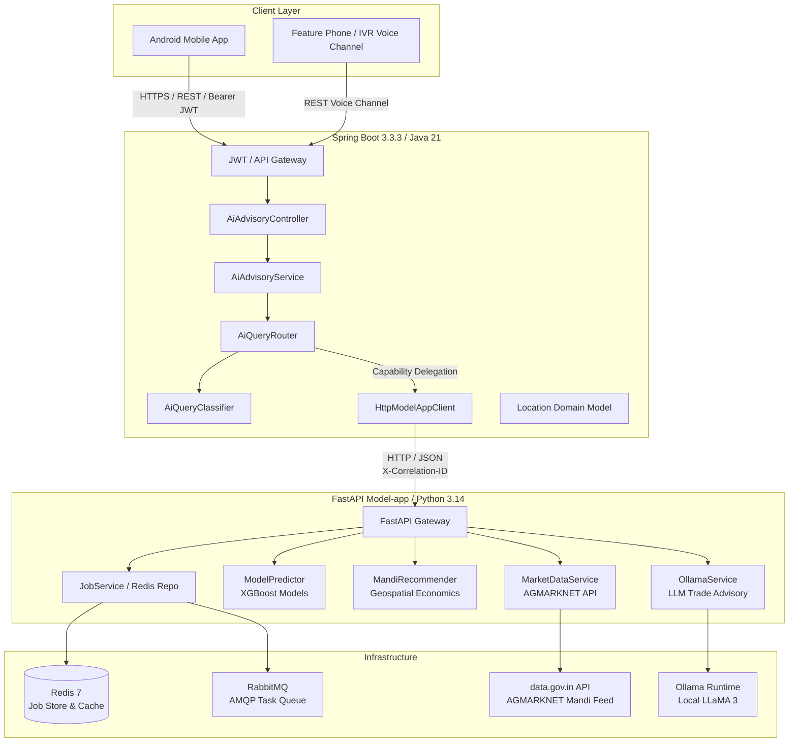

# MarketLink

**SIH Problem Statement 26132: Strengthening Market Linkages and Price Discovery for Farmers**

MarketLink is an intelligent agricultural trade enablement and direct market linkage platform. It eliminates non-value-adding intermediaries by connecting farmers directly with verified buyers while providing deterministic AI trade advisory, real-time government mandi prices, machine-learning-driven price forecasting, and geospatial net-return mandi recommendations.

---

## System Architecture

MarketLink utilizes a distributed, multi-tier microservice architecture where the **Spring Boot Core Backend** serves as the authenticated public API gateway, and the **FastAPI Model-app** operates as an internal AI/ML inference, market data, and background queue processing engine.



---

## Core Capabilities

| Capability | Component | Description | Data Source |
| :--- | :--- | :--- | :--- |
| **Direct Marketplace** | Core Backend | Farmer produces listed as Lots; buyers place binding offers with secure acceptance/rejection lifecycle. | PostgreSQL / JPA |
| **Natural Language Advisory** | Core Backend + Model-app | Deterministic intent classification routing farmer inquiries to the appropriate domain engine. | Multi-tier orchestration |
| **Current Mandi Prices** | Model-app | Daily modal, minimum, and maximum commodity prices and arrivals across regional mandis. | data.gov.in (AGMARKNET) |
| **Next-Day Price Prediction** | Model-app | Machine learning price forecasts with expected direction (`UP`/`DOWN`), change percentage, and reliability scores. | XGBoost Regressors |
| **Mandi Recommendation** | Model-app | Distance-aware financial ranking comparing gross revenues, transport haulage costs, and mandi fees to calculate true net returns. | MandiRecommender + Haversine |
| **General Agronomy Advisory** | Model-app | Crop cultivation, pest prevention, storage guidance, and agronomy queries answered via local LLM. | Ollama (LLaMA 3) |
| **Combined Analytical Query** | Core Backend | Seamless synthesis of price forecasting and geospatial mandi recommendations for complex farmer decisions. | XGBoost + Recommender |
| **Location Domain Modeling** | Core Backend | Strict coordinate boundary validation (`[-90, 90]`, `[-180, 180]`) ensuring zero coordinate fabrication. | `Location` Embeddable |
| **Asynchronous Job Engine** | Model-app | Decoupled background task queue with atomic state transitions (`QUEUED` $\rightarrow$ `PROCESSING` $\rightarrow$ `COMPLETED`/`FAILED`). | Redis 7 + RabbitMQ |

---

## Technology Stack

### Core Backend
- **Language**: Java 21 (LTS)
- **Framework**: Spring Boot 3.3.3
- **Security**: Spring Security, JJWT (0.12.5), stateless token authentication
- **HTTP Client**: Spring 6 `RestClient` with explicit timeouts and MDC correlation tracking
- **Persistence**: Spring Data JPA (PostgreSQL / H2 in-memory for testing), Spring Data MongoDB (image metadata)
- **Validation**: Jakarta Bean Validation (`@DecimalMin`, `@DecimalMax`, `@NotBlank`)
- **API Documentation**: SpringDoc OpenAPI 2.6.0 (Swagger UI)
- **Build Tool**: Apache Maven Wrapper (`./mvnw`)

### AI/ML Model-app
- **Language**: Python 3.14 (Virtual Environment)
- **Framework**: FastAPI, Pydantic v2, Uvicorn (ASGI)
- **ML / Data Science**: XGBoost, Scikit-Learn, Pandas, NumPy
- **Job Persistence**: Redis 7 (`redis-py`)
- **Message Broker**: RabbitMQ (`pika`) with persistent delivery and correlation IDs
- **LLM Integration**: Ollama API (`requests` / internal client)
- **Test Framework**: `pytest`, `pytest-mock`, `anyio`

---

## Repository Structure

```
MarketLink/
├── README.md                      # Project overview, architecture, and quickstart
├── docs/                          # Comprehensive technical and architecture documentation
│   ├── README.md                  # Documentation table of contents
│   ├── architecture/              # System, backend, model-app, and routing architecture
│   ├── api/                       # OpenAPI contracts, query API, and error handling
│   ├── ai-ml/                     # XGBoost pipelines, routing heuristics, market data, Ollama
│   ├── development/               # Developer setup, environment configuration, workflow
│   ├── security/                  # JWT, secret management, sanitized error policies
│   ├── operations/                # Deployment topology, observability, troubleshooting
│   ├── testing/                   # Testing strategy, baseline results, verification records
│   └── decisions/                 # Architecture Decision Records (ADRs)
├── backend/                       # Spring Boot Core Backend
│   ├── src/main/java/             # Source code (ai, auth, domain, market, marketplace, voice)
│   ├── src/main/resources/        # application.yml, schema configurations
│   ├── src/test/java/             # Unit and integration tests (147 test suite)
│   ├── pom.xml                    # Maven dependencies
│   └── mvnw                       # Maven wrapper script
├── Model-app/                     # FastAPI AI/ML Microservice
│   ├── src/                       # Source code
│   │   ├── api/                   # FastAPI routers and schemas
│   │   ├── core/                  # Configuration, logging, exception handlers
│   │   ├── data/                  # AGMARKNET data fetchers and mergers
│   │   ├── messaging/             # RabbitMQ publisher and consumer workers
│   │   ├── models/                # XGBoost ModelPredictor and registry
│   │   ├── recommendation/        # MandiRecommender economics engine
│   │   ├── repositories/          # RedisJobRepository
│   │   └── services/              # JobService, OllamaService, MarketDataService
│   ├── tests/                     # Test suites (151 test suite)
│   ├── data/                      # Model JSON artifacts, mandi coordinates, lookup tables
│   ├── requirements.txt           # Python dependencies
│   └── README.md                  # Model-app service documentation
└── .env.example                   # Environment configuration template
```

---

## Quick Start & Development Setup

### 1. Prerequisites
- **Java 21 JDK**
- **Python 3.10+** (Virtual environment configured in `.venv`)
- **Redis 7** (Default port `6379`)
- **RabbitMQ** (Default port `5672`)
- **Ollama** (Optional for local LLM advisory, default port `11434`)

### 2. Environment Configuration
Copy the template file to configure local variables:
```bash
cp .env.example .env
```
Key environment variables:
```properties
# Model-app
MODEL_APP_PORT=8000
DATA_GOV_API_KEY=your_datagov_key_here
REDIS_HOST=localhost
REDIS_PORT=6379
RABBITMQ_HOST=localhost
RABBITMQ_PORT=5672
OLLAMA_BASE_URL=http://localhost:11434

# Core Backend
SERVER_PORT=8080
MODEL_APP_BASE_URL=http://localhost:8000
JWT_SECRET=your_base64_jwt_secret_here
```

### 3. Running Model-app
```bash
cd Model-app
../.venv/bin/uvicorn src.main:app --host 127.0.0.1 --port 8000 --reload
```
Verify process health:
```bash
curl -s http://127.0.0.1:8000/health
```

### 4. Running Core Backend
```bash
cd backend
./mvnw spring-boot:run
```
Swagger UI will be accessible at:
```
http://localhost:8080/swagger-ui/index.html
```

---

## Testing & Verification Status

MarketLink strictly adheres to empirical, reproducible verification. Testing status as of Phase 2B:

- **Core Backend Suite**: **147 / 147 passed (100%)** via `./mvnw test` in `11.63s`.
  - Zero failures, zero errors across domain logic, security, location boundaries, HTTP client mocks, deterministic classifiers, and controller integration.
- **Model-app Targeted Phase 1/1C Suite**: **50 / 50 passed (100%)** via `pytest` in `9.19s`.
  - Zero failures across API endpoints, Redis persistence, RabbitMQ messaging, and Ollama failure handling.
- **Model-app Full Suite**: **139 passed, 12 failed (0 errors)** across 151 total tests.
  - The 12 test failures are pre-existing, well-documented deferred deployment issues resulting from missing historical CSV feature files (`bareilly_final_features.csv`, etc.) and live external `data.gov.in` rate-limit timeouts. No synthetic data was fabricated.

---

## Documentation Index

Detailed documentation is available in the [`docs/`](docs/) directory:

- [System Architecture](docs/architecture/system-architecture.md)
- [Core Backend Architecture](docs/architecture/core-backend-architecture.md)
- [Model-app Architecture](docs/architecture/model-app-architecture.md)
- [AI Query Routing & Classification](docs/architecture/ai-query-routing.md)
- [API Reference & Contracts](docs/api/core-backend-api.md)
- [Location Domain Model](docs/architecture/core-backend-architecture.md#location-domain-model)
- [Asynchronous Job Architecture](docs/operations/deployment.md#asynchronous-job-architecture)
- [Troubleshooting Guide](docs/operations/troubleshooting.md)
- [Architecture Decision Records (ADRs)](docs/decisions/architecture-decisions.md)

---

## Current vs. Future Roadmap

| Area | Current Implementation Status | Future Roadmap (Subsequent SIH Rounds) |
| :--- | :--- | :--- |
| **Android Client** | REST/Multipart client specifications defined. | Native Android Jetpack Compose app with GPS auto-fill. |
| **Core Backend** | Complete JWT auth, Lot lifecycle, Location model, AI router, 147 passing tests. | Multi-language localized response templates, WebSockets. |
| **AI Routing** | Deterministic rule-based classifier (English + Hinglish). | Hybrid deterministic + embeddings-based semantic classifier. |
| **ML Inference** | Structural XGBoost model registry; baseline preloading. | Pipeline feature CSV artifact delivery; retrained models. |
| **Mandi Recommendation**| Geospatial financial engine calculating net returns. | Dynamic haulage pricing via real-time logistics APIs. |
| **Advisory LLM** | Controlled Ollama LLaMA 3 integration with structured errors. | Fine-tuned agricultural SLM deployed on edge infrastructure. |
