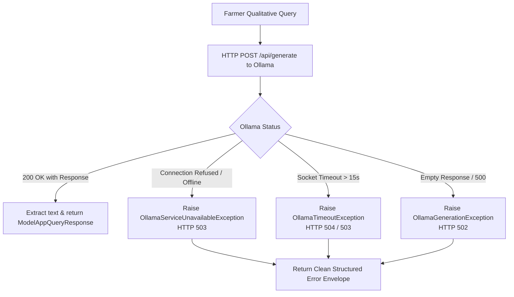

# Ollama Local LLM Integration

## 1. Overview & Architectural Role

MarketLink integrates **Ollama** (`Model-app/src/services/ollama_service.py`) as a local, private Large Language Model runtime to deliver conversational agricultural advisory.

- **Default Runtime Endpoint**: `http://localhost:11434`
- **Default Model**: `llama3` (or configured via `OLLAMA_MODEL`)
- **Primary Scope**: Agricultural agronomy, plant disease identification, fertilizer recommendations, harvest timing, and post-harvest storage management.

---

## 2. Strict Boundary Rules

### 2.1 What Ollama Is Used For
- Answering qualitative farming questions (e.g. *"How to store potatoes to prevent sprouting?"*).
- Explaining the agronomic rationale behind crop diseases and pest cycles.
- Translating technical recommendations into clear, accessible agricultural advice.

### 2.2 What Ollama Is NEVER Used For
- **Never Used for Factual Spot Market Prices**: LLMs do not possess live real-time APMC price records; querying an LLM for spot rates causes severe price hallucinations. Spot prices originate exclusively from AGMARKNET.
- **Never Used for Numerical Predictions**: Price forecasting is performed by trained XGBoost regressors with strict statistical confidence intervals.
- **Never Used for Intent Routing**: Intent classification is performed by the deterministic regex/keyword engine (`AiQueryClassifier`) to prevent routing latency and ambiguity.

---

## 3. Controlled Failure Handling (Phase 1C Standard)

Following Phase 1C design requirements, the system enforces **controlled failure behavior**:

> [!WARNING]
> **No Heuristic Substitutes**:
> If Ollama is offline or times out, the service **does not** fabricate an AI response, does not generate hardcoded synthetic advice, and does not silently substitute a canned response. It returns a clean, transparent service-unavailable error so the farmer is not misled.
