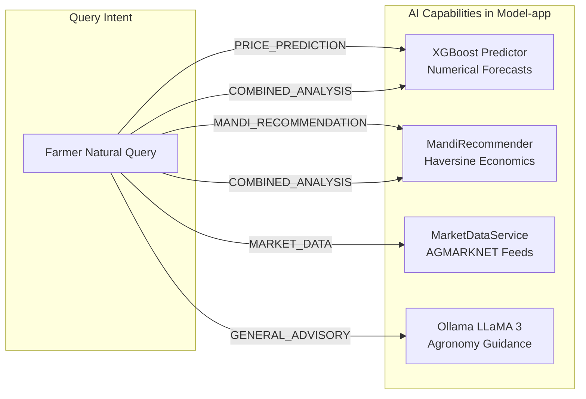

# AI & Machine Learning Subsystem Overview

## 1. Architectural Philosophy

The AI/ML subsystem in MarketLink is engineered around **reliability, domain explainability, and factual fidelity**. In agricultural trading, providing incorrect price data or ungrounded recommendations directly damages farmer livelihoods.

### Core Design Rules:
1. **Separation of Cognitive Roles**:
   - **Quantitative Machine Learning (XGBoost)** handles numerical price forecasting.
   - **Deterministic Geospatial Economics** handles distance and haulage fee calculations.
   - **Authoritative Ingestion** handles historical and live mandi prices.
   - **Large Language Models (Ollama / LLaMA 3)** handle natural language comprehension, linguistic explanations, and qualitative agronomic guidance.
2. **No LLM Hallucination of Prices**: Factual prices must originate from real AGMARKNET records, and numerical forecasts must originate from trained ML regressors. Ollama is **never** asked to guess market prices.
3. **Deterministic Routing**: Intent classification occurs before any heavy computation, ensuring queries take the most direct, explainable execution path.

---

## 2. Capability Matrix

| Capability | Engine | Purpose | Output Format | Authority Type |
| :--- | :--- | :--- | :--- | :--- |
| **Price Forecasting** | XGBoost Regressor | Next-day modal price forecast, expected change ($\pm$), direction (`UP`/`DOWN`). | Structured JSON (Numeric) | Machine Learning Model |
| **Mandi Recommendation** | Haversine + Economics | Ranks mandis by calculated Net Return after deducting transportation and market fees. | Ranked List (Financial) | Deterministic Economics |
| **Spot Market Prices** | AGMARKNET Ingestion | Current and recent daily modal, minimum, and maximum mandi prices. | Records Array (Factual) | Government AGMARKNET API |
| **General Agronomy** | Ollama (LLaMA 3) | Pest prevention, post-harvest storage, cultivation, and soil management. | Textual Explanation | Generative LLM |

---

## 3. Current Implementation vs. Future AI Direction

### Current Implemented Architecture
- XGBoost regressors remain the core implemented prediction models across supported commodity-market pairs.
- Ollama is integrated inside Model-app as a contained, local LLM service for general agronomy advisory.
- Deterministic regex/keyword heuristics route queries instantly without LLM classification overhead.

### Future / Proposed AI Strategy (Subsequent SIH Rounds)
- **Hybrid Intent Classification**: Introducing small edge embeddings (e.g. `all-MiniLM-L6-v2`) to complement regex heuristics for nuanced local dialects.
- **Fine-Tuned Agricultural Small Language Model (SLM)**: Training an SLM (such as Mistral-7B or LLaMA-3-8B-Instruct) on ICAR (Indian Council of Agricultural Research) agronomic bulletins and regional mandi price histories.
- **Dynamic Multimodal Produce Grading**: Connecting image-based visual quality assessment models directly to the mandi recommender to adjust modal prices according to detected produce grade.

> [!NOTE]
> The items above are strictly **FUTURE / PROPOSED** architectural directions. The current repository implementation uses XGBoost regressors and Ollama LLaMA 3.
