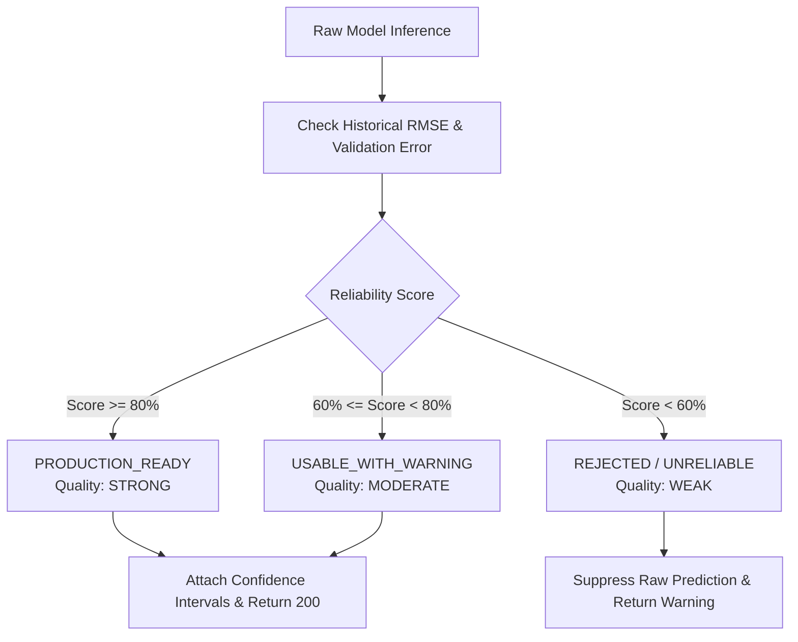

# Machine Learning Price Prediction Engine

## 1. Overview

MarketLink's price prediction engine forecasts the **next-day modal price** of agricultural produce in specific mandis using trained **XGBoost Regressors**. 

- **Subsystem**: `Model-app/src/models/model_predictor.py`
- **Output Metrics**: Predicted price, expected change ($\pm$), price direction (`UP`/`DOWN`), confidence interval, reliability score.
- **Audience**: Consumed by Core Backend for farmer advisory and combined decision analysis.

---

## 2. Quality Gate & Reliability Evaluation

Before returning a prediction, `ModelPredictor` passes the inference through an automated **Quality Gate**:

### Quality Class Definitions:
- **`STRONG` (Production Ready)**: Model exhibiting high historical accuracy ($\text{RMSE} < 100 \text{ INR/quintal}$), fresh data feeds, and low feature drift.
- **`MODERATE` (Usable with Warning)**: Model based on cached data or slightly higher variance; transparently flags that the farmer should verify local mandi sentiment.
- **`WEAK` (Rejected)**: Suppresses misleading forecasts to prevent farmer financial harm.

---

## 3. Mathematical Calculations

### 3.1 Price Forecast & Change
$$\hat{y} = \text{Current Price} + \Delta_{\text{predicted}}$$
$$\text{Expected Change} = \hat{y} - \text{Current Price}$$
$$\text{Expected Change Pct} = \left( \frac{\text{Expected Change}}{\text{Current Price}} \right) \times 100$$

### 3.2 Direction Classification
$$\text{Direction} = \begin{cases} 
\text{UP} & \text{if } \text{Expected Change} > 0 \\ 
\text{DOWN} & \text{if } \text{Expected Change} < 0 \\ 
\text{STABLE} & \text{if } \text{Expected Change} = 0 
\end{cases}$$

### 3.3 Confidence Bounds
$$\text{Lower Bound} = \max(0, \hat{y} - 1.96 \times \text{RMSE})$$
$$\text{Upper Bound} = \hat{y} + 1.96 \times \text{RMSE}$$

---

## 4. Known Limitation: Missing Feature Artifacts

As documented across the project audit:
- The XGBoost model architecture is completely implemented and passes unit verification.
- The companion feature CSV files (e.g. `bareilly_final_features.csv`) required to construct lag inputs at runtime are missing from the training export.
- This is classified as a **DEPLOYMENT ARTIFACT GAP** and remains a deferred deployment task for the ML pipeline team.
