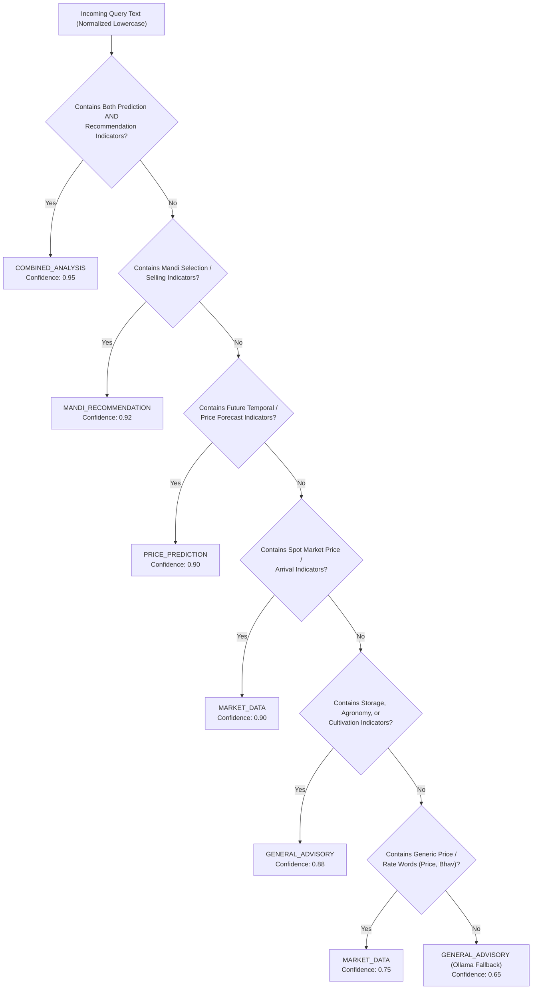

# Deterministic Query Classification & Heuristics

## 1. Classifier Overview

The `AiQueryClassifier` component (`com.marketlink.backend.ai.classifier.AiQueryClassifier`) is a high-performance, deterministic intent parser. It evaluates incoming natural-language queries without making external LLM calls, avoiding latency spikes and non-deterministic routing errors.

### Design Principles:
- **Execution Time**: $< 1 \text{ millisecond}$.
- **Multilingual Support**: Supports common agricultural English, Hindi, and Hinglish phrasing.
- **Explainability**: Every classification includes a confidence score and audit trail of matched rules.

---

## 2. Classification Decision Tree



---

## 3. Pattern Matching Rules & Regular Expressions

### 3.1 `PRICE_PREDICTION` Regex Pattern
```regex
\b(predict|prediction|forecast|future|next\s+week|next\s+month|tomorrow|expected\s+price|future\s+price|price\s+estimate|what\s+price\s+can\s+i\s+expect|kya\s+bhav\s+milega|bhav\s+milega|rate\s+milega|aage\s+ka\s+bhav|aage\s+ka\s+rate)\b
```

### 3.2 `MANDI_RECOMMENDATION` Regex Pattern
```regex
\b(where\s+should\s+i\s+sell|which\s+mandi|which\s+market|best\s+mandi|best\s+market|recommended\s+mandi|recommend\s+mandi|where\s+can\s+i\s+get\s+better\s+price|where\s+to\s+sell|kahan\s+bechun|kahan\s+bechna|kaunsi\s+mandi|sahi\s+mandi|mandi\s+suggest)\b
```

### 3.3 `MARKET_DATA` Regex Pattern
```regex
\b(today'?s?\s+price|current\s+price|market\s+price|mandi\s+price|latest\s+price|what\s+is\s+the\s+price|what\s+is\s+today|aaj\s+ka\s+bhav|aaj\s+ka\s+rate|bhav\s+kya\s+hai|rate\s+kya\s+hai|current\s+rate|modal\s+price)\b
```

### 3.4 `GENERAL_ADVISORY` Regex Pattern
```regex
\b(how\s+to\s+store|store|storage|cultivate|cultivation|fertilizer|prevent\s+spoilage|spoilage|disease|pest|fungus|keede|khad|kheti|kheti\s+badi|how\s+to\s+grow|irrigation|soil)\b
```

---

## 4. Entity Extraction: Commodity & Market

If the incoming request does not explicitly provide the `crop` or `market` fields, the classifier scans the query text using verified lookup tables:

### Commodity Resolver:
- **Onion**: `onion`, `pyaj`, `pyaaz`
- **Potato**: `potato`, `aloo`
- **Tomato**: `tomato`, `tamatar`
- **Wheat**: `wheat`, `gehu`, `gehun`
- **Rice**: `rice`, `chawal`, `dhan`
- *Default*: `"Onion"`

### Market Resolver:
- Scans for known mandis: `Bareilly`, `Nagpur`, `Agra`, `Kolar`, `Khanna`, `Indore`, `Burdwan`, `Bargarh`, `Nashik`, `Pune`, `Delhi`, `Azadpur`.
- Normalizes casing (e.g. `"nagpur"` $\rightarrow$ `"Nagpur"`).

---

## 5. Precedence & Ambiguity Resolution

1. **Combined Analysis Always Takes Precedence**: When a farmer asks:
   > *"Which mandi should I sell my onions in next week considering expected price?"*
   The classifier detects both future price forecast indicators and mandi selection indicators, triggering `COMBINED_ANALYSIS` rather than collapsing into single-engine execution.
2. **Contextual Fallback**: If a query mentions price words without future indicators (e.g. *"onion ka bhav"*), it is classified as `MARKET_DATA` (spot price).
3. **Conversational Fallback**: Ambiguous or general conversational queries (e.g. *"Good morning, what should I know today?"*) fall back to `GENERAL_ADVISORY` to be answered conversationally by Ollama.
