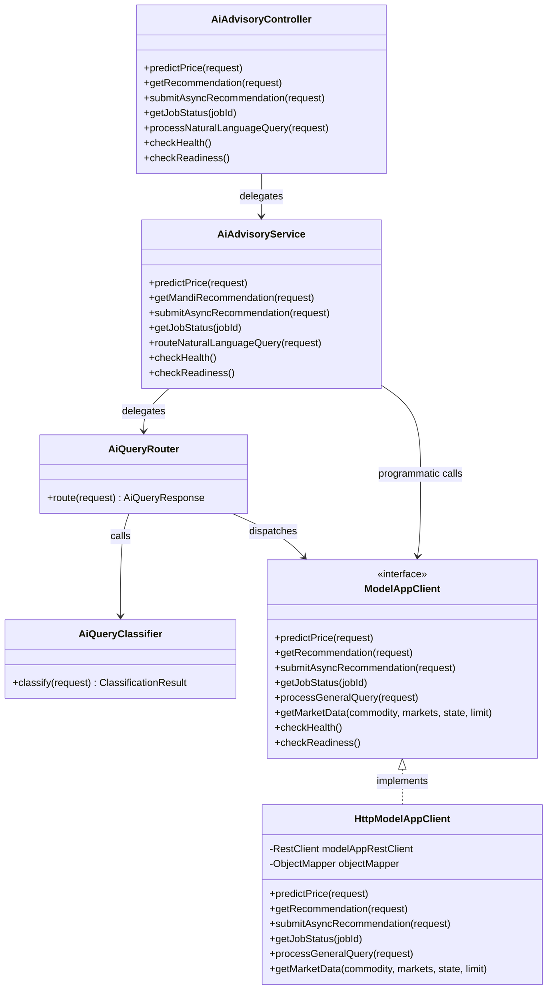

# Core Backend Architecture

## 1. Overview & Technologies

The MarketLink Core Backend is built with **Spring Boot 3.3.3** running on **Java 21 LTS**. It acts as the authenticated business gateway and primary transactional engine for the MarketLink platform.

### Core Stack:
- **Framework**: Spring Boot 3.3.3, Spring Web MVC
- **Security**: Spring Security 6 with stateless JJWT (`0.12.5`) bearer tokens
- **Persistence**: Spring Data JPA (PostgreSQL production / H2 in-memory test), Spring Data MongoDB (image metadata)
- **Validation**: Jakarta Bean Validation (Hibernate Validator 8.0.1)
- **HTTP Client**: Spring 6 `RestClient` with `SimpleClientHttpRequestFactory`
- **Documentation**: SpringDoc OpenAPI 2.6.0 (Swagger 3)

---

## 2. Package Architecture

The codebase is organized in `com.marketlink.backend` using domain-driven packaging:

```
com.marketlink.backend
├── ai/                                    # AI integration subsystem
│   ├── classifier/                        # AiQueryClassifier (deterministic intent parsing)
│   ├── client/                            # ModelAppClient interface & HttpModelAppClient implementation
│   ├── config/                            # ModelAppProperties & ModelAppClientConfig
│   ├── controller/                        # AiAdvisoryController (/api/v1/ai/**)
│   ├── dto/
│   │   ├── modelapp/                      # Dedicated Model-app contract DTOs
│   │   └── query/                         # AiNaturalLanguageQueryRequest & AiQueryResponse
│   ├── enums/                             # AiQueryIntent enum
│   ├── exception/                         # ModelAppException hierarchy
│   ├── router/                            # AiQueryRouter capability orchestrator
│   └── service/                           # AiAdvisoryService application service
├── auth/                                  # Authentication & registration controllers/services
├── common/                                # Shared infrastructure
│   ├── context/                           # CorrelationIdContext (ThreadLocal + MDC)
│   ├── exception/                         # ApiException & GlobalExceptionHandler
│   ├── filter/                            # CorrelationIdFilter (Servlet filter)
│   └── response/                          # ApiResponse<T> & ErrorResponse
├── domain/                                # Core domain entities & value objects
│   ├── common/entity/                     # Location (@Embeddable geographic coordinates)
│   ├── market/entity/                     # Market master entity (state, district, code)
│   ├── marketplace/entity/                # Lot, LotProduce, Bid, Offer entities
│   └── user/entity/                       # User, FarmerProfile, BuyerProfile entities
├── marketplace/                           # Marketplace listing & bidding services
├── offer/                                 # Direct buyer offer & farmer acceptance services
├── security/                              # Spring Security config, JWT filter, authorization policies
└── voice/                                 # Voice-channel adapters for IVR / feature phones
```

---

## 3. Location Domain Model

### 3.1 Architectural Rationale
In agricultural logistics, transportation haulage costs and transit spoilage directly influence the farmer's net profit. Rather than treating latitude and longitude as untyped floating-point numbers or hardcoding synthetic defaults, MarketLink establishes `Location` as a first-class domain value object.

### 3.2 Implementation: `Location.java`
Located at `com.marketlink.backend.domain.common.entity.Location`:
```java
@Embeddable
@Getter
@Setter
@NoArgsConstructor
@AllArgsConstructor
@Builder
@EqualsAndHashCode
public class Location {

    @NotNull(message = "Latitude is required")
    @DecimalMin(value = "-90.0", message = "Latitude must be between -90.0 and 90.0")
    @DecimalMax(value = "90.0", message = "Latitude must be between -90.0 and 90.0")
    @Column(name = "latitude")
    private Double latitude;

    @NotNull(message = "Longitude is required")
    @DecimalMin(value = "-180.0", message = "Longitude must be between -180.0 and 180.0")
    @DecimalMax(value = "180.0", message = "Longitude must be between -180.0 and 180.0")
    @Column(name = "longitude")
    private Double longitude;

    public static Location of(Double latitude, Double longitude) {
        if (latitude != null && (latitude < -90.0 || latitude > 90.0)) {
            throw new IllegalArgumentException("Latitude must be between -90.0 and 90.0");
        }
        if (longitude != null && (longitude < -180.0 || longitude > 180.0)) {
            throw new IllegalArgumentException("Longitude must be between -180.0 and 180.0");
        }
        return new Location(latitude, longitude);
    }
}
```

### 3.3 Boundary Rules & Anti-Patterns Avoided
- **Defensive Invariant Checks**: Rejects $\text{lat} < -90$, $\text{lat} > 90$, $\text{lng} < -180$, $\text{lng} > 180$.
- **Zero Coordinate Fabrication**: The system **never** defaults missing coordinates to `(0,0)`, the geographic center of India, or IP-based synthetic coordinates. If an operation requires geospatial context and coordinates are absent, a `ModelAppValidationException` is returned.
- **JPA Embeddable**: Can be embedded directly into `FarmerProfile`, `Lot`, or `Market` entities via `@Embedded`.

---

## 4. AI Advisory Layer Architecture

The AI Advisory subsystem enforces strict SOLID principles:



### 4.1 Separation of Responsibilities
1. **Controller Layer (`AiAdvisoryController`)**:
   - Thin REST boundary.
   - Validates incoming JSON payloads via `@Valid`.
   - Maps responses into standard `ApiResponse<T>` envelopes.
   - Declares OpenAPI documentation annotations (`@Operation`, `@ApiResponses`).
2. **Service Layer (`AiAdvisoryService`)**:
   - Application coordinator.
   - Integrates user context and orchestrates calls between query router and domain services.
3. **Router Layer (`AiQueryRouter`)**:
   - Executes deterministic intent workflows based on `AiQueryClassifier` output.
   - Synthesizes combined responses when multiple capabilities are required.
4. **Client Layer (`HttpModelAppClient`)**:
   - Manages connection and read timeouts.
   - Injects `X-Correlation-ID` header.
   - Translates upstream HTTP error responses into sanitized domain exceptions.

---

## 5. Security & Authentication Architecture

### 5.1 Stateless JWT Architecture
- Every client request includes `Authorization: Bearer <jwt_token>`.
- `JwtAuthenticationFilter` validates the signature, extracts the user ID and role (`ROLE_FARMER`, `ROLE_BUYER`), and populates `SecurityContextHolder`.
- Non-whitelisted endpoints deny unauthenticated requests by default.

### 5.2 Whitelisted Endpoints
- `/api/v1/auth/**`: Login, token refresh, OTP verification.
- `/swagger-ui/**`, `/v3/api-docs/**`: API documentation.
- `/api/v1/ai/health`, `/api/v1/ai/ready`: Internal infrastructure health probes.

---

## 6. Global Exception Handling & Response Envelopes

### 6.1 Unified Response Wrapper: `ApiResponse<T>`
```json
{
  "success": true,
  "message": "Price forecast generated successfully",
  "data": { ... },
  "timestamp": "2026-09-03T12:00:00Z"
}
```

### 6.2 Unified Error Envelope: `ErrorResponse`
```json
{
  "success": false,
  "status": 503,
  "message": "AI model service is currently unavailable",
  "timestamp": "2026-09-03T12:00:00Z"
}
```
All domain exceptions extend `ApiException`. The `GlobalExceptionHandler` intercepts them, logs the error with its correlation ID, and sanitizes the output to ensure zero internal secrets or paths are leaked.
