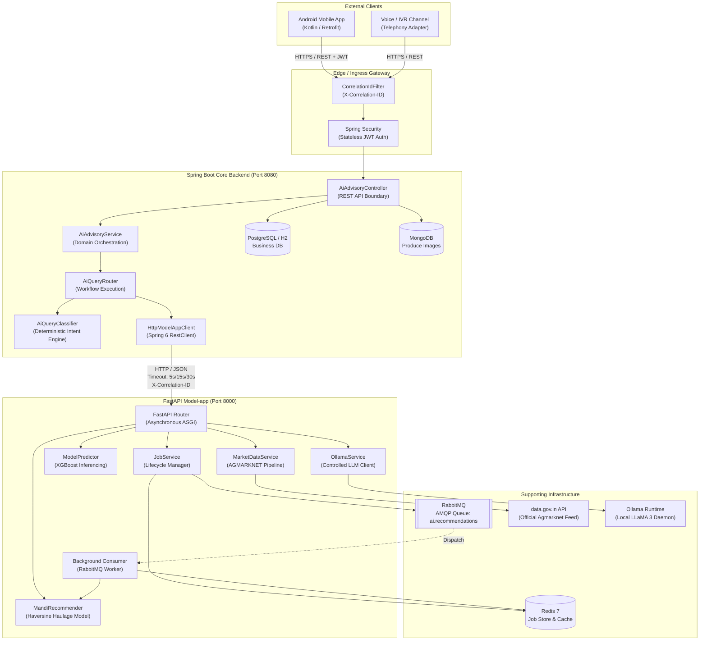
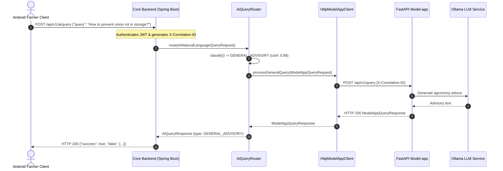
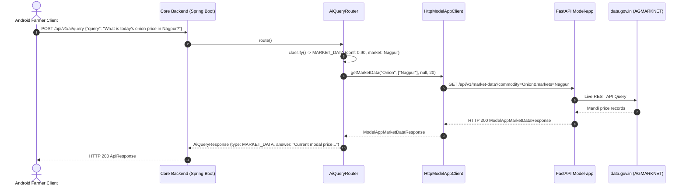
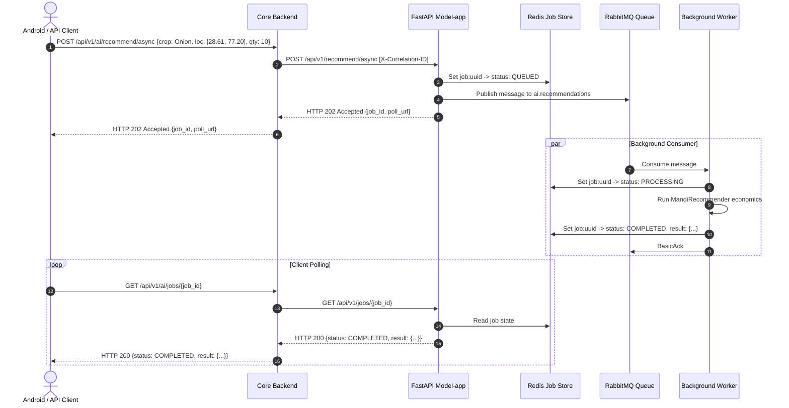

# Complete System Architecture

## 1. Architectural Overview

MarketLink is designed as a distributed, decoupled multi-tier system engineered to bridge agricultural direct selling with intelligent trade insights. The system enforces strict separation of concerns across presentation, domain orchestration, AI/ML inference, and asynchronous task execution.

---

## 2. Component Responsibility Matrix

| Component | Primary Responsibility | Strict Boundaries (Must NOT Do) |
| :--- | :--- | :--- |
| **Android Client** | User interface, farmer input capture, camera produce photos, JWT presentation. | **Must NOT** access Model-app, Redis, RabbitMQ, or Ollama directly. |
| **Core Backend Gateway** | Public ingress, JWT authentication, request validation, domain persistence, correlation tracking. | **Must NOT** implement XGBoost inference, mandi distance algorithms, or call Ollama directly. |
| **AiAdvisoryController** | Thin HTTP REST boundary, `@Valid` validation, OpenAPI 3 annotations. | **Must NOT** contain business logic, query classification, or direct HTTP client invocations. |
| **AiAdvisoryService** | Business coordination, farmer profile integration, service delegation. | **Must NOT** manipulate raw HTTP requests, construct URLs, or serialize JSON. |
| **AiQueryClassifier** | Deterministic intent parsing (English + Hinglish), confidence estimation, entity extraction. | **Must NOT** invoke external LLMs merely to classify intent. |
| **AiQueryRouter** | Multi-capability routing, combining ML forecasts with geospatial mandi ranking. | **Must NOT** perform inference calculations inside Java; delegates to `ModelAppClient`. |
| **HttpModelAppClient** | Internal HTTP transport, connection/read timeouts, `X-Correlation-ID` header injection, sanitized exception translation. | **Must NOT** leak raw upstream error JSON or expose internal server filesystem paths to callers. |
| **FastAPI Model-app** | AI/ML inference, government data caching, local LLM integration, async job queue. | **Must NOT** handle user authentication, buyer-farmer lot lifecycle, or direct client billing. |
| **ModelPredictor** | XGBoost next-day modal price predictions, confidence intervals, model quality gating. | **Must NOT** fabricate predictions when required feature CSV files are absent. |
| **MandiRecommender** | Haversine distance, transportation haulage economics, mandi fee deduction, net returns. | **Must NOT** invent coordinates when farmer location is missing. |
| **OllamaService** | General agricultural advisory (cultivation, agronomy, storage, pest advice). | **Must NOT** hallucinate factual spot market prices or numerical forecasts. |
| **Redis 7** | Shared transient cache, atomic job state transitions (`QUEUED`, `PROCESSING`, `COMPLETED`, `FAILED`). | **Must NOT** be treated as a permanent relational business store. |
| **RabbitMQ** | Reliable asynchronous job delivery with persistent queues and consumer acknowledgements. | **Must NOT** execute computation directly; acts purely as message broker. |

---

## 3. End-to-End Sequence Diagrams

### 3.1 Synchronous Natural Language AI Query Flow

### 3.2 Factual Mandi Market Data Flow

### 3.3 Asynchronous Mandi Recommendation Job Flow

---

## 4. Non-Functional Requirements & Design Principles

### 4.1 Fault Isolation & Circuit Protection
- **Decoupled Architecture**: If Model-app is offline or experiencing heavy load, Core Backend operational services (auth, profiles, lot listings, direct buyer offers) remain 100% operational.
- **Controlled Failure Translation**: External service failures (e.g. data.gov.in API timeouts, Ollama offline) are converted into structured, sanitized HTTP 502/503 domain exceptions without throwing unhandled 500 crashes.

### 4.2 Security & Least Privilege
- **Internal Microservice Isolation**: Model-app, Redis, RabbitMQ, and Ollama are deployed on an internal private network and are never directly addressable from public Android clients.
- **Zero Credential Leakage**: Database connection strings, RabbitMQ credentials, Redis authentication keys, and `DATA_GOV_API_KEY` are injected exclusively via environment variables and never surfaced in client responses.

### 4.3 Observability & Request Tracing
- **Correlation ID Tracking**: Every inbound request to Core Backend receives or preserves an `X-Correlation-ID` header, injected into SLF4J MDC, logged across Spring components, and transmitted over HTTP to Model-app, enabling distributed request tracing.
